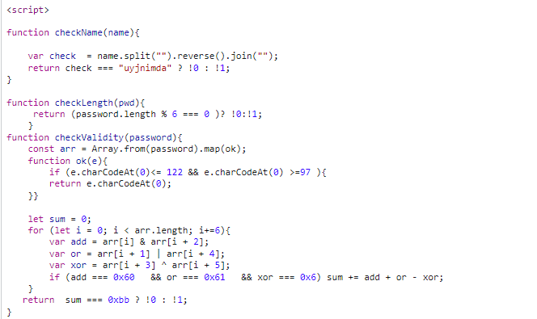
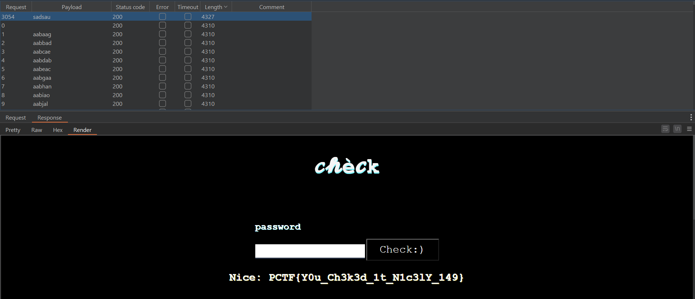

# Patriot CTF

## Scavenger Hunt

- Bài này chỉ đơn giản là lấy flag ở trong các file js, index, cookies, và đường dẫn crawler `/robots.txt`.

## Checkmate

- Đầu tiên đọc src của trang web. Có một đoạn script js làm crypto. Giải thì sẽ tìm được username=`adminjyyu` và password='aabaag' và rất nhiều mật khẩu nữa thỏa mãn.



- Em còn tìm được thêm một đường dẫn check.php ở trong phần src. Dẫn đến một trang web khác. Em nghĩ nó sẽ check mật khẩu đúng thỏa mãn trong đống password kia. 
- Em sẽ brute để tạo tất cả mật khẩu đúng cho vào file password.txt

```python
with open(r'C:\Users\admin\Desktop\CTF\password.txt', "a") as file:
    file.truncate(0)
f=open(r'C:\Users\admin\Desktop\CTF\password.txt', "a")
for i1 in range(97,123):
    for i2 in range(97,123):
        for i3 in range(97,123):
            for i4 in range(97,123):
                for i5 in range(97,123):
                    for i6 in range(97,123):
                        if i1 & i3 == 96 and i2 | i5 == 97 and i4 ^ i6 == 6:
                            password=chr(int(i1))+chr(int(i2))+chr(int(i3))+chr(int(i4))+chr(int(i5))+chr(int(i6))
                            f.write(password+'\n')
f.close()
```

- Sau đó em sẽ dùng burp suite intruder để kiểm tra với payload là cái đống password.txt kia



- Ở đây có mật khẩu `sadsau` có length duy nhất là 4327 so với còn lại nên nó cũng chứa flag luôn.


